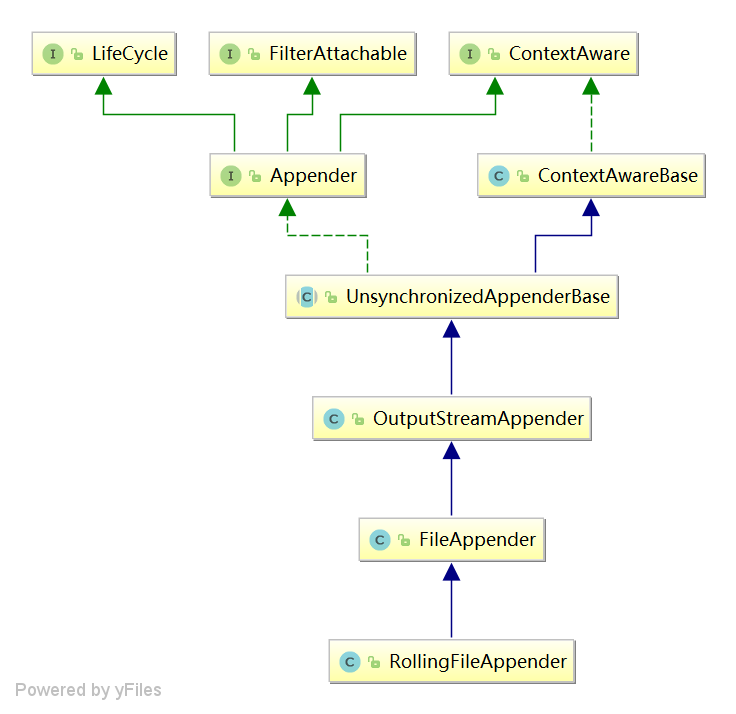

## 一、何为Appender？

appender将控制你的日志输出到什么地方？控制台or文件，高级一点的appender还可以控制你的日志文件是按时间滚动还是按文件大小滚动，
本篇文章将重点分析下 ch.qos.logback.core.rolling.RollingFileAppender

## 二、RollingFileAppender

### 2.1 类图



我们现在对上面的继承接口和实现做个简单的介绍

- LifeCycle：定义了start与stop方法，在使用某对象之前需要先start，关闭时使用stop，通常一些
初始化准备操作会写在这个start方法中，而释放资源，关闭流会写在stop方法中
- ContextAware：日志上下文aware，类似spring中的各种aware，比如ApplicationContextAware，继承该接口的类，会在使用前
注入日志上下文对象，除此之外还有一些addInfo，addWarn等添加状态的接口，在具体的实现中会记录到一个集合中，超过大小之后会
缓存在环形缓存中，另外还会除非状态监听器
- FilterAttachable：过滤器集，用来维护过滤器，比如 LevelFilter，用于控制日志是否允许输出
- Appender：输出日志的接口
- ContextAwareBase：ContextAware的基本实现
- UnsynchronizedAppenderBase：Appender的抽象模板，定义了基本的防止重入与调用filter决定是否输出日志的基本功能
- OutputStreamAppender：定义了重定向输出流与调用编码器处理日志的能力
- FileAppender：在start中确定文件，然后重定向输出流为文件
- RollingFileAppender：新增可以滚动文件日志的能力

下面我们会比较具体的去分析 UnsynchronizedAppenderBase -》RollingFileAppender的重要实现部分，首先我们来看UnsynchronizedAppenderBase
它的输出日志方法代码如下：
```java
public void doAppend(E eventObject) {
        // 检查当前线程是否已调用过该方法，防止重入
        if (Boolean.TRUE.equals(guard.get())) {
            return;
        }

        try {
            // 标记当前线程已执行该方法
            guard.set(Boolean.TRUE);
            // 在使用当前Appender之前必须先调用strat方法
            if (!this.started) {
                // 允许提示警告的次数
                if (statusRepeatCount++ < ALLOWED_REPEATS) {
                    addStatus(new WarnStatus("Attempted to append to non started appender [" + name + "].", this));
                }
                return;
            }
            // 从filter集合中检查当前日志是否允许输出，比如我们常用的
            // LevelFilter用于限制只能输出指定日志级别的日志还是大于该级别即可输出
            if (getFilterChainDecision(eventObject) == FilterReply.DENY) {
                return;
            }

            // 这时一个抽象方法，需要子类去实现
            this.append(eventObject);

        } catch (Exception e) {
            if (exceptionCount++ < ALLOWED_REPEATS) {
                addError("Appender [" + name + "] failed to append.", e);
            }
        } finally {
            guard.set(Boolean.FALSE);
        }
    }
    
    // 抽象模板方法，需子类实现
    abstract protected void append(E eventObject);
```
可以看到 UnsynchronizedAppenderBase 实现了基本的过滤方法，具体怎么写出日志还需子类实现，那么我们继续来看看
OutputStreamAppender 的实现代码：

```java
@Override
  protected void append(E eventObject) {
      if (!isStarted()) {
          return;
      }

      subAppend(eventObject);
  }
```
append方法只是检查了下当前Appender是否start，如果没有start将不允许执行，其主要逻辑实现在subAppend方法中：

```java
protected void subAppend(E event) {
      if (!isStarted()) {
          return;
      }
      try {
          // 此处会做一些日志消息格式化的操作，比如你的日志里有 {} 这个的大括号
          // 那么这里将会替换成对应的参数
          if (event instanceof DeferredProcessingAware) {
              ((DeferredProcessingAware) event).prepareForDeferredProcessing();
          }
          // 调用编码器对日志进行编码处理
          byte[] byteArray = this.encoder.encode(event);
          // 写出日志
          writeBytes(byteArray);

      } catch (IOException ioe) {
          // as soon as an exception occurs, move to non-started state
          // and add a single ErrorStatus to the SM.
          this.started = false;
          addStatus(new ErrorStatus("IO failure in appender", this, ioe));
      }
  }
```
可以看到上面的代码对我们传入的日志消息做了格式化并且调用了编码器进行编码，编码完成之后调用了如下方法：

```java
private void writeBytes(byte[] byteArray) throws IOException {
        if(byteArray == null || byteArray.length == 0)
            return;
        
        lock.lock();
        try {
            // 调用输出流输出日志
            this.outputStream.write(byteArray);
            // 是否立即刷盘
            if (immediateFlush) {
                this.outputStream.flush();
            }
        } finally {
            lock.unlock();
        }
    }
```
写出日志的方法非常简单，调用输出流直接输出即可，到这里呢，其实数据已经刷出去了，至于输出到哪，那么跟你的outputStream
有关系了，你直接set你自己想要输出的流就可以，聪明的你肯定也能想到FileAppender做了什么了，
其实FileAppender就是把输出流修改成了输出到某个文件的FileOutputStream，它在start方法中做了以下操作：
```java
public void openFile(String file_name) throws IOException {
        lock.lock();
        try {
            File file = new File(file_name);
            // 创建文件目录
            boolean result = FileUtil.createMissingParentDirectories(file);
            if (!result) {
                addError("Failed to create parent directories for [" + file.getAbsolutePath() + "]");
            }
            // 重定向输出流
            ResilientFileOutputStream resilientFos = new ResilientFileOutputStream(file, append, bufferSize.getSize());
            resilientFos.setContext(context);
            setOutputStream(resilientFos);
        } finally {
            lock.unlock();
        }
    }
```
上面这个方法重定向了输出流